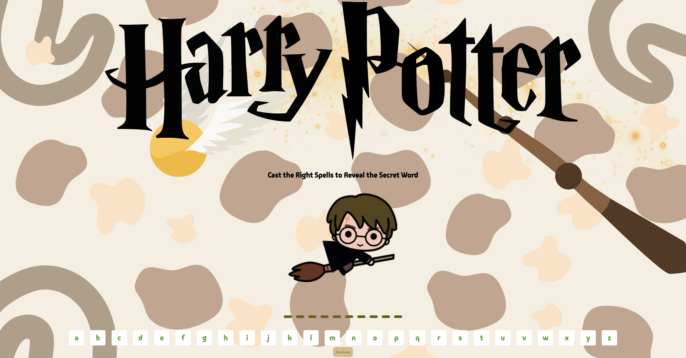

# Harry Potter Game ⚡️

Welcome to the Harry Potter version of the Spaceman Game! In this game you'll have the opportunity to 
cast the right spells to reveal the secret word related to the magical world of Harry Potter. 

## Table of Contents: 
1. [Introduction](#introduction) 
2. [Features](#features)
3. [How to Play](#how-to-play) 
4. [Technologies Used](#technologies-used)
5. [Play the Harry Potter Game](#play-the-harry-potter-game) 
6. [Future Enhancements](#future-enhancements)

## Introduction:⚡️
In this game, you'll step into the shoes of a young wizard eager to demonstrate their magical skill! Your task is to cast 
the right spells, to reveal the secret word to the world of Harry Potter. With each correct guess, a piece of the puzzle 
will appear and bring you closer to uncovering the hidden word. 

BEWARE! Every incorrect guess brings you one step closer to losing the game. The fate of your magical journey rests 
in your ablitiy to choose wisely and unveil the secrets that lie within the enchanted words. 

">

## Background:⚡️ 
The Harry Potter series, created by J.K. Rowling, has captivated audiences worldwide with it's tales of friendship, 
courage and the power of magic. Set in the world of wizardry, the series follows the adventures of Harry Potter and his 
friends as they navigate the trials and tribulations of Hogwarts School of Witchcraft and Wizardry. 

## Features:⚡️ 
Letter Selection: Players can select a letter on the page to guess the hidden word. 
Word Revelation: With each correct guess, the player can reveal parts of the hidden word, getting closer to solving the puzzle. 
Progressive Challenge: Incorrect guesses lead to the gradual disappearance of the picture of Harry Potter flying on his broom. 
Limited Guesses: Players have a maximum of 6 wrong guesses before its game over. 
Audio: Experience the magic of Harry Potter with immersive audio! The game features the iconic Harry Potter theme music. 

## How to Play:⚡️ 
1. Start the Game: Upon entering the webpage, a hidden word related to the magical world of Harry Potter is generated. 
2. Guess the Word: To uncover the  hidden word, select a letter from the avaliable options on the page. 
3. Correct Guesses: With each correct guess, parts of the hidden word will be revealed, bringing you closer to solving 
the puzzle.
4. Incorrect Guesses: Be cautious! If you guess incorrectly, the picture of Harry Potter flying on his broom will 
gradually disappear. You have a maximum of 6 wrong guesses, a game over image will appear, signallying the end of the game.
5. Try Again: If you wish to embark on another magical adventure, simply select "New Game" and the bottom of the page to start fresh. 

## Technologies Used:⚡️ 
1. HTML
2. CSS
3. JavaScript 

## Play the Harry Potter Game:⚡️
Click [here](https://theannagreen.github.io/Harry-Potter-Game/) to play the Harry Potter Game! 

## Future Enhancements:⚡️
In the near future I plan on revisiting this game and making the following technical enhancements: 
    1. Scoreboard: I would implement a scoreboard to track the performance of the player during the game. 
    2. Hint System: I would add a hint system to provide players with clues about the secret word. 
    3. Language: I would provide support for multiple languages to make the game accessible to a wider audience. Upon entering the webpage I would have a popup that would allow players to choose their preferred language for their user interface and game text. 